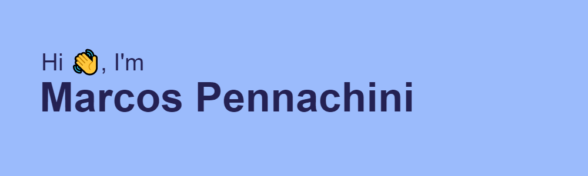

- 👀 I’m interested in Frontend development
- ❤️️ I really love CSS and styling things
- 🌱 I’m currently practicing React.js
- 📫 How to reach me [Linkedin](linkedin.com/in/marcos-pennachini-b39898123) 

## Tecnology stack

I also use tu use

</img></img>

## Some stats

<!--
## Reach me on

  &nbsp;&nbsp;&nbsp;&nbsp;
  
--->

<!---
MarcosPennachini/MarcosPennachini is a ✨ special ✨ repository because its `README.md` (this file) appears on your GitHub profile.
You can click the Preview link to take a look at your changes.
--->
